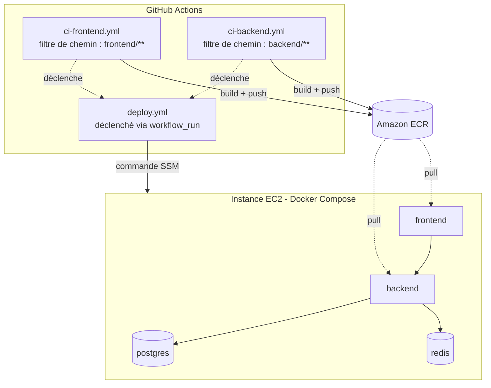

[🇬🇧 English](./README.md) | 🇫🇷 Français

# price-tracer-devops

Une application multi-services (frontend + backend + base de données) déployée sur AWS via un pipeline CI/CD entièrement automatisé, conçue pour un monorepo : chaque service est construit et déployé indépendamment, sans jamais reconstruire ni redémarrer ce qui n'a pas changé.

> ⚠️ Complétez les sections marquées `[...]` avec les détails exacts de votre projet avant publication.

## Table des matières

- [Vue d'ensemble](#vue-densemble)
- [Architecture](#architecture)
- [Stack technique](#stack-technique)
- [Structure du repo](#structure-du-repo)
- [Pipeline CI/CD](#pipeline-cicd)
- [Développement local](#développement-local)
- [Variables d'environnement](#variables-denvironnement)
- [Déploiement en production](#déploiement-en-production)
- [Sécurité](#sécurité)
- [Feuille de route](#feuille-de-route)

## Vue d'ensemble

**price-tracer** scrape les annonces de produits sur différentes plateformes e-commerce, vérifie leur prix actuel, et stocke l'historique en base de données. Quand le prix d'un produit suivi baisse, l'application alerte et notifie l'utilisateur pour qu'il ne rate jamais une bonne affaire.

**Démo en ligne :** _(pas encore disponible publiquement)_

## Architecture



Chaque pipeline de build (`ci-frontend`, `ci-backend`) ne se déclenche que si les fichiers du service correspondant ont changé. Le workflow `deploy.yml` est découplé des builds : il est déclenché par l'événement `workflow_run` et lit `github.event.workflow_run.name` pour savoir exactement quel service redéployer — sans jamais toucher aux autres conteneurs (`postgres` et `redis` continuent de tourner en continu).

## Stack technique

| Composant | Technologie |
|---|---|
| Frontend | React |
| Backend | FastAPI (Python) |
| Tests / linting | ESLint (frontend), Pytest (backend) |
| Base de données | PostgreSQL 16 |
| Cache | Redis 7 |
| Conteneurisation | Docker, Docker Compose |
| CI/CD | GitHub Actions |
| Registre d'images | Amazon ECR |
| Hébergement | AWS EC2 |
| Orchestration du déploiement | AWS SSM Run Command |
| Scan de vulnérabilités | Trivy |
| Authentification cloud | OIDC (GitHub ↔ AWS, sans clés statiques) |

## Structure du repo

```
price-tracer-devops/
├── backend/                  # API et logique métier
│   ├── [...]
│   └── Dockerfile
├── frontend/                 # Interface utilisateur
│   ├── [...]
│   └── Dockerfile
├── .github/
│   └── workflows/
│       ├── ci-frontend.yml   # Build + push de l'image frontend
│       ├── ci-backend.yml    # Build + push de l'image backend
│       └── deploy.yml        # Déploiement ciblé sur EC2 via SSM
└── docker-compose.prod.yml   # Généré/mis à jour par le pipeline de déploiement
```

## Pipeline CI/CD

1. **Un push modifie `frontend/**` ou `backend/**`** → seul le workflow correspondant se déclenche (filtres de chemin), évitant un rebuild inutile de l'autre service.
2. **Tests et linting** exécutés sur le code modifié.
3. **Build de l'image Docker**, taguée avec le SHA du commit (`image:SHA`, jamais `latest` en production, pour permettre un rollback précis à tout moment).
4. **Scan Trivy** de l'image : le pipeline s'arrête si une vulnérabilité CRITICAL ou HIGH est détectée.
5. **Push vers Amazon ECR**.
6. **`deploy.yml` se déclenche** via `workflow_run`, identifie le service concerné, et envoie une commande SSM à l'instance EC2.
7. **L'instance EC2 met à jour uniquement le conteneur concerné** (`docker compose pull <service>` puis `up -d --no-deps <service>`), sans redémarrer les autres.

Aucune clé AWS statique n'est stockée dans GitHub : l'authentification passe par OIDC (`aws-actions/configure-aws-credentials`), avec un rôle IAM dédié pour le runner GitHub et un rôle IAM distinct pour l'instance EC2.

## Développement local

### Prérequis

- Node.js (installé via `nvm`) pour le frontend
- Python 3.x pour le backend
- Docker et Docker Compose

### Installation

```bash
git clone https://github.com/Lmntrixo/price-tracer-devops.git
cd price-tracer-devops

# Backend
cd backend
pip install -r requirements.txt
uvicorn main:app --reload

# Frontend
cd frontend
npm install
npm start
\`\`\`

### Lancer avec Docker Compose

```bash
docker compose up -d
```

L'application est ensuite disponible à :
- Frontend : `http://localhost:3000`
- Backend/API : `http://localhost:8000`

## Variables d'environnement

Créez un fichier `.env` à la racine (voir `.env.example`) avec :

```
POSTGRES_USER=
POSTGRES_PASSWORD=
POSTGRES_DB=
POSTGRES_HOST=
REDIS_HOST=
REDIS_PORT=
# [Autres variables spécifiques au backend/frontend]
```

> En production, `POSTGRES_PASSWORD` est géré via AWS SSM Parameter Store (SecureString) et n'est jamais stocké dans les GitHub Secrets ni committé dans le repo.

## Déploiement en production

Le déploiement est entièrement automatisé : un push sur `main` touchant `frontend/` ou `backend/` déclenche le pipeline correspondant, qui construit, scanne, pousse l'image vers ECR, puis met à jour uniquement le service concerné sur l'instance EC2 — sans interruption pour les autres services.

Infrastructure cible :
- **Instance EC2** : `price-tracer-server` (région `eu-central-1`)
- **Registre d'images** : Amazon ECR (un dépôt par service)
- **Secrets** : AWS SSM Parameter Store

## Sécurité

- Authentification GitHub → AWS via **OIDC**, sans clés d'accès statiques.
- Secrets sensibles (mots de passe DB) stockés en **SecureString** dans AWS SSM Parameter Store.
- Scan de vulnérabilités **Trivy** obligatoire avant tout push vers ECR (le pipeline échoue en cas de faille CRITICAL/HIGH).
- Accès à l'instance EC2 exclusivement via **AWS SSM Session Manager** — aucun port SSH exposé.
- Images Docker immuables, taguées par SHA de commit (pas de `latest` en production).

## Feuille de route

- [ ] Monitoring (Prometheus/Grafana ou CloudWatch)
- [ ] Infrastructure as Code avec Terraform
- [ ] HTTPS (certificat + reverse proxy)
- [ ] Signature d'images avec Cosign
- [ ] Migration vers ECS/Fargate ou Kubernetes pour l'orchestration multi-services

## Licence

Aucune licence spécifiée pour l'instant — tous droits réservés par LMNTRIXO