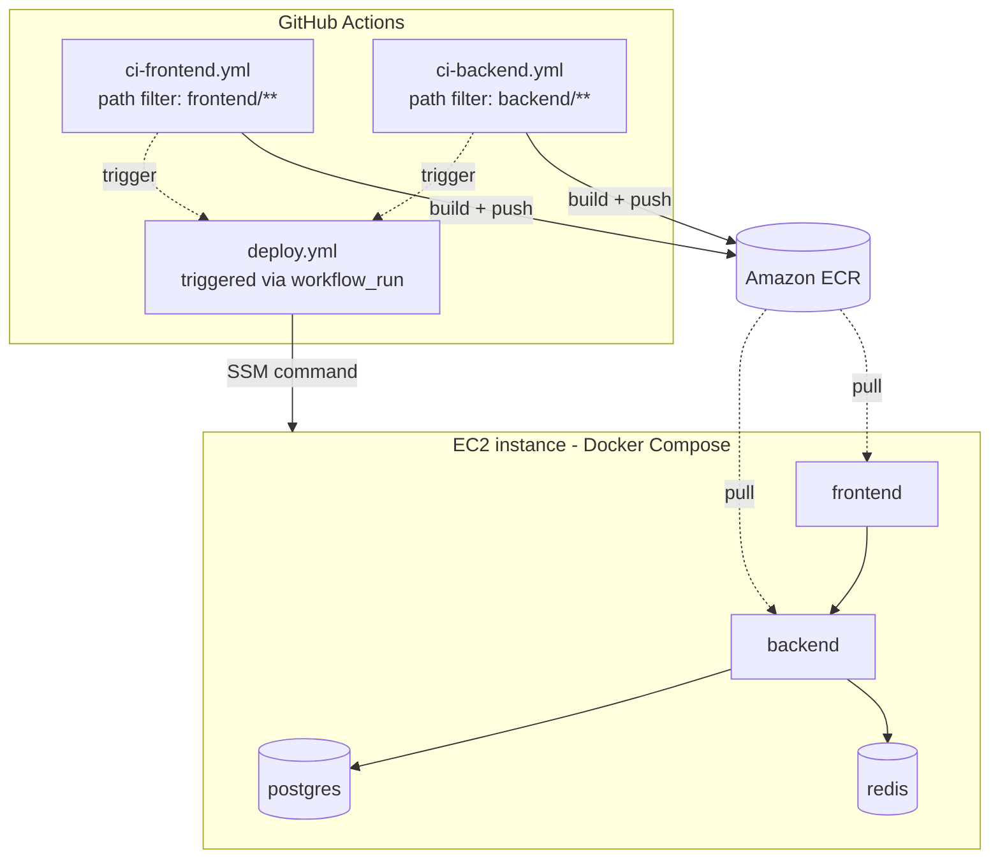

🇬🇧 English | [🇫🇷 Français](./README.fr.md)

# price-tracer-devops

A multi-service application (frontend + backend + database) deployed on AWS through a fully automated CI/CD pipeline, built for a monorepo: each service is built and deployed independently, without ever rebuilding or restarting what hasn't changed.

## Table of contents

- [Overview](#overview)
- [Architecture](#architecture)
- [Tech stack](#tech-stack)
- [Repo structure](#repo-structure)
- [CI/CD pipeline](#cicd-pipeline)
- [Local development](#local-development)
- [Environment variables](#environment-variables)
- [Production deployment](#production-deployment)
- [Security](#security)
- [Roadmap](#roadmap)

## Overview

**price-tracer** scrapes product listings across e-commerce platforms, checks their current price, and stores the history in a database. When a tracked product's price drops, the application alerts and notifies the user so they never miss a deal.

**Live demo:** _(not publicly available yet)_

## Architecture



Each build pipeline (`ci-frontend`, `ci-backend`) only triggers if the corresponding service's files have changed. The `deploy.yml` workflow is decoupled from the builds: it's triggered by the `workflow_run` event and reads `github.event.workflow_run.name` to know exactly which service to redeploy — without ever touching the other containers (`postgres` and `redis` keep running continuously).

## Tech stack

| Component | Technology |
|---|---|
| Frontend | React |
| Backend | FastAPI (Python) |
| Testing / linting | ESLint (frontend), Pytest (backend) |
| Database | PostgreSQL 16 |
| Cache | Redis 7 |
| Containerization | Docker, Docker Compose |
| CI/CD | GitHub Actions |
| Image registry | Amazon ECR |
| Hosting | AWS EC2 |
| Deployment orchestration | AWS SSM Run Command |
| Vulnerability scanning | Trivy |
| Cloud authentication | OIDC (GitHub ↔ AWS, no static keys) |

## Repo structure

```
price-tracer-devops/
├── backend/                  # API and business logic
│   ├── [...]
│   └── Dockerfile
├── frontend/                 # User interface
│   ├── [...]
│   └── Dockerfile
├── .github/
│   └── workflows/
│       ├── ci-frontend.yml   # Build + push frontend image
│       ├── ci-backend.yml    # Build + push backend image
│       └── deploy.yml        # Targeted deployment on EC2 via SSM
└── docker-compose.prod.yml   # Generated/updated by the deployment pipeline
```

## CI/CD pipeline

1. **A push modifies `frontend/**` or `backend/**`** → only the corresponding workflow triggers (path filters), avoiding an unnecessary rebuild of the other service.
2. **Tests and linting** run against the changed code.
3. **Docker image build**, tagged with the commit SHA (`image:SHA`, never `latest` in production, to allow a precise rollback at any time).
4. **Trivy scan** of the image: the pipeline stops if a CRITICAL or HIGH vulnerability is found.
5. **Push to Amazon ECR**.
6. **`deploy.yml` triggers** via `workflow_run`, identifies the affected service, and sends an SSM command to the EC2 instance.
7. **The EC2 instance updates only the affected container** (`docker compose pull <service>` then `up -d --no-deps <service>`), without restarting the others.

No static AWS keys are stored in GitHub: authentication goes through OIDC (`aws-actions/configure-aws-credentials`), with a dedicated IAM role for the GitHub runner and a separate IAM role for the EC2 instance.

## Local development

### Prerequisites

- Node.js (installed via `nvm`) for the frontend
- Python 3.12 for the backend
- Docker and Docker Compose

### Installation

```bash
git clone https://github.com/Lmntrixo/price-tracer-devops.git
cd price-tracer-devops

# Backend
cd backend
pip install -r requirements.txt
uvicorn main:app --reload

# Frontend
cd frontend
npm install
npm start
```

### Run with Docker Compose

```bash
docker compose up -d
```

The application is then available at:
- Frontend: `http://localhost:3000`
- Backend/API: `http://localhost:8000`

## Environment variables

Create a `.env` file at the root (see `.env.example` ) with:

```
POSTGRES_USER=
POSTGRES_PASSWORD=
POSTGRES_DB=
POSTGRES_HOST=
REDIS_HOST=
REDIS_PORT=
# [Other backend/frontend-specific variables]
```

> In production, `POSTGRES_PASSWORD` is managed through AWS SSM Parameter Store (SecureString) and is never stored in GitHub Secrets or committed to the repo.

## Production deployment

Deployment is fully automated: a push to `main` touching `frontend/` or `backend/` triggers the corresponding pipeline, which builds, scans, pushes the image to ECR, then updates only the affected service on the EC2 instance — with no downtime for the other services.

Target infrastructure:
- **EC2 instance**: `price-tracer-server` (region `eu-central-1`)
- **Image registry**: Amazon ECR (one repository per service)
- **Secrets**: AWS SSM Parameter Store

## Security

- GitHub → AWS authentication via **OIDC**, no static access keys.
- Sensitive secrets (DB passwords) stored as **SecureString** in AWS SSM Parameter Store.
- Mandatory **Trivy** vulnerability scan before any push to ECR (the pipeline fails on a CRITICAL/HIGH finding).
- Access to the EC2 instance exclusively via **AWS SSM Session Manager** — no SSH port exposed.
- Immutable Docker images, tagged by commit SHA (no `latest` in production).

## Roadmap

- [ ] Monitoring (Prometheus/Grafana or CloudWatch)
- [ ] Infrastructure as Code with Terraform
- [ ] HTTPS (certificate + reverse proxy)
- [ ] Image signing with Cosign
- [ ] Migration to ECS/Fargate or Kubernetes for multi-service orchestration

## License

No license specified yet — all rights reserved LMNtrixo